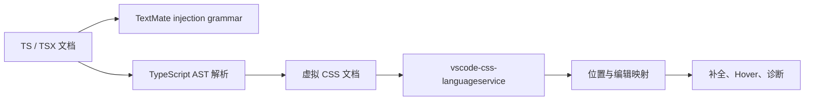

# next-yak VS Code 内嵌 CSS 扩展设计

## 背景

项目使用 `next-yak` 的 tagged template literal 定义样式，例如：

```tsx
const Header = styled.header`
  width: min(calc(100% - 32px), 760px);
  color: #176b5b;
`
```

模板内容在语义上是 CSS，但宿主文档仍是 TypeScript、TSX、JavaScript 或 JSX。现有的 `@styled/typescript-styled-plugin` 与 `styled-components.vscode-styled-components` 可以作为临时辅助方案，但无法可靠地、以 `next-yak` 为目标提供完整的语法高亮和 CSS IntelliSense。

本设计定义一个面向 `next-yak` 的 VS Code 扩展技术路线。

## 目标

- 在 `next-yak` 样式模板内提供 CSS 语法高亮。
- 在 CSS 位置提供属性、值、函数、at-rule 和自定义属性补全。
- 正确处理 `${...}` TypeScript/TSX 插值，并将其交给 TypeScript 语言服务。
- 为后续 hover、颜色装饰、诊断和代码操作保留可复用的基础设施。
- 仅影响编辑器体验，不改变 next-yak 的运行时、Vite 构建或 Oxfmt 格式化行为。

## 非目标

- 不自行实现 CSS 属性、值和浏览器兼容性数据库。
- 不在第一版中兼容所有 CSS-in-JS 库。
- 不依赖正则表达式判断某个 `styled` 标识符是否来自 `next-yak`。
- 不将 TypeScript server plugin 作为第一版的必需条件。

## 总体架构

高亮与语言功能应分开实现：



TextMate grammar 负责让模板视觉上按 CSS 着色；扩展宿主内的 TypeScript AST 解析和虚拟 CSS 文档负责语言智能功能。二者共享模板标签的约定，但不必共用同一套解析实现。

## 支持的模板形式

第一版应识别下列 `next-yak` API：

```tsx
import { css, globalStyle, keyframes, styled } from 'next-yak'

const Panel = styled.div`...`
const CustomPanel = styled(Component)`...`
const rules = css`...`
const animation = keyframes`...`
globalStyle`...`
```

第二阶段再支持别名和命名空间导入：

```tsx
import { styled as s } from 'next-yak'
import * as yak from 'next-yak'

const Panel = s.div`...`
const rules = yak.css`...`
```

## 高亮方案：TextMate 注入 grammar

扩展通过 `contributes.grammars` 注册 injection grammar，并注入下列 scope：

- `source.ts`
- `source.tsx`
- `source.js`
- `source.jsx`

grammar 在标准模板标签中识别 CSS 内容，嵌入现成的 CSS grammar，并将 `${...}` 内部重新交给 JavaScript 或 TypeScript grammar。扩展应声明 `embeddedLanguages`，使括号匹配、注释和基础编辑器行为能够识别模板内的 CSS。

TextMate grammar 只适合静态、标准形式的标签识别。它不能可靠判断导入来源、局部变量遮蔽或复杂的表达式，因此高亮层可以覆盖 `styled`、`css`、`globalStyle`、`keyframes` 等常见写法，但不能作为语义判定的唯一依据。

## 补全方案：AST 加虚拟 CSS 文档

扩展使用 `vscode.languages.registerCompletionItemProvider` 注册 TypeScript、TSX、JavaScript 和 JSX 文档的补全提供器。每次补全请求执行以下流程：

```mermaid
flowchart TD
  request[用户在 TSX 模板中请求补全] --> locate[定位光标所在 tagged template]
  locate --> isNextYak{标签来自 next-yak？}
  isNextYak -- 否 --> fallback[返回 undefined\n由其他语言服务处理]
  isNextYak -- 是 --> interpolation{光标位于 ${...}？}
  interpolation -- 是 --> typescript[返回 undefined\n由 TypeScript 提供补全]
  interpolation -- 否 --> virtual[生成虚拟 CSS 文档]
  virtual --> complete[调用 CSS Language Service]
  complete --> map[将 CSS 编辑范围映射回 TSX]
  map --> result[返回 CSS 补全项]
```

1. 用 TypeScript Compiler API 解析当前文档并定位光标所在的 tagged template。
2. 解析导入绑定，确认模板标签来自 `next-yak`。
3. 若光标在 `${...}` 插值内，返回 `undefined`，由 TypeScript 提供原生补全。
4. 将模板的静态文本转换为虚拟 CSS 文档。
5. 调用 `vscode-css-languageservice` 计算 CSS 补全。
6. 将返回的 `TextEdit`、说明和替换范围映射回原始 TSX 文档。

例如，以下两种光标位置应有不同的所有者：

```tsx
const Header = styled.header`
  col|
  color: |
  color: ${props => props.color|};
`
```

- 第一处由 CSS 服务建议 `color` 等属性。
- 第二处由 CSS 服务建议颜色、函数、`var()` 等值。
- 第三处由 TypeScript 服务建议 `props` 上的成员。

## 虚拟 CSS 文档与位置映射

模板中的插值不能原样送入 CSS 解析器。实现时应以等长度、保留换行的占位符替换 `${...}`，例如：

```tsx
const Panel = styled.div`
  color: ${(props) => props.color};
`
```

可以转换为概念上的虚拟文档：

```css
color: ______________________;
```

映射层必须保存以下信息：

- 原始模板文本的起始 offset。
- 每段静态 CSS 文本在原文与虚拟文档中的 offset 对应关系。
- 每个插值表达式的原始范围与虚拟占位范围。
- 光标是否落在插值内。

这样可以稳定地将 CSS Language Service 的范围、编辑和诊断映射回宿主文档，也能避免多行插值导致行列位置漂移。

## 语义识别规则

补全层不能只检查标签文本是否叫作 `styled`。它应通过 AST 和导入声明验证绑定来源：

```tsx
import { styled } from 'next-yak'

const A = styled.div`...` // 支持

const styled = makeCustomFactory()
const B = styled.div`...` // 不应当当作 next-yak
```

建议的第一版范围：

- 识别 `import { styled, css, globalStyle, keyframes } from 'next-yak'`。
- 支持同一文件内没有遮蔽的直接绑定。
- 忽略无法确认来源的标签。

在第二版中引入别名、命名空间导入以及 TypeScript checker，以获得更精确的符号解析。

## 建议依赖

- `vscode`：扩展宿主 API。
- `typescript`：AST、语法范围和可选的 symbol checker。
- `vscode-css-languageservice`：CSS 补全、hover、诊断与颜色能力。
- `vscode-languageserver-textdocument`：创建 CSS Language Service 所需的文本模型。
- `@vscode/test-electron`：端到端扩展测试。

可选依赖：

- `@vscode/vsce` 或 `@vscode/vsce` 的替代打包工具：发布 VSIX。
- `@vscode/textmate`：仅当扩展需要在测试中直接断言 grammar token 时使用。

## 扩展清单结构

建议的初始结构如下：

```text
next-yak-vscode/
  package.json
  tsconfig.json
  src/
    extension.ts
    nextYakTemplateLocator.ts
    virtualCssDocument.ts
    cssCompletionProvider.ts
  syntaxes/
    next-yak.injection.json
  test/
    fixtures/
    suite/
```

`package.json` 的贡献点至少包含：

```json
{
  "activationEvents": [
    "onLanguage:typescript",
    "onLanguage:typescriptreact",
    "onLanguage:javascript",
    "onLanguage:javascriptreact"
  ],
  "contributes": {
    "grammars": [
      {
        "scopeName": "next-yak.injection",
        "path": "./syntaxes/next-yak.injection.json",
        "injectTo": ["source.ts", "source.tsx", "source.js", "source.jsx"]
      }
    ]
  }
}
```

实际 scope 名称应以 VS Code 内置 TypeScript grammar 的 scope 为准，并通过 grammar inspector 验证。

## 实施阶段

### 第一阶段：可用 MVP

- 注册 TextMate injection grammar，为标准模板形式嵌入 CSS grammar。
- 实现直接具名导入的 `next-yak` 模板定位器。
- 提供 CSS 属性和值补全。
- 正确跳过 `${...}` 内的补全请求。
- 为虚拟文档映射编写纯函数单元测试。

### 第二阶段：识别可靠性

- 支持 `styled as s` 与 `import * as yak`。
- 支持 `styled(Component)`。
- 支持多行、嵌套和复杂插值。
- 使用 TypeScript checker 排除局部遮蔽与同名非 next-yak API。

### 第三阶段：语言体验

- CSS hover 与颜色装饰。
- CSS 语法诊断，并将诊断映射回宿主文档。
- 工作区自定义属性索引和补全。
- 面向变量、mixins 或 next-yak 特有约束的代码操作。

## 测试策略

优先将模板定位、插值遮蔽与位置映射实现为没有 VS Code 运行时依赖的纯函数，并覆盖：

- `styled.div`、`styled(Component)`、`css`、`globalStyle`、`keyframes`。
- 具名导入、别名导入、命名空间导入。
- 同名局部变量遮蔽。
- 单行和多行插值。
- 插值前、插值中、插值后的补全位置。
- 嵌套规则、at-rule、CSS 自定义属性和不完整 CSS。

再通过 `@vscode/test-electron` 验证：打开 TSX fixture 时，扩展能够在模板 CSS 区域返回补全，并在插值区域让 TypeScript 保持优先级。

## 与当前项目的关系

当前项目可以保留 `@styled/typescript-styled-plugin`、工作区 TypeScript SDK 配置和 `styled-components.vscode-styled-components` 推荐项，作为扩展尚未发布前的临时体验增强。

自研扩展稳定后，需要评估是否移除或禁用 `styled-components.vscode-styled-components` 的相关能力，以避免同一模板同时获得重复补全或发生 TextMate grammar 优先级冲突。`@styled/typescript-styled-plugin` 是否保留，则应根据其仍然提供的诊断价值单独判断。

## 决策

优先实现一个仅面向 `next-yak` 的 VS Code 扩展：用 TextMate grammar 完成高亮，用 TypeScript AST、虚拟 CSS 文档和 `vscode-css-languageservice` 完成补全。不要在第一版就引入独立 LSP 或尝试兼容所有 CSS-in-JS 框架。

只有当需要复用到 Neovim、Zed 等非 VS Code 编辑器时，再将模板解析器和虚拟 CSS 服务抽取为独立的 Language Server。
